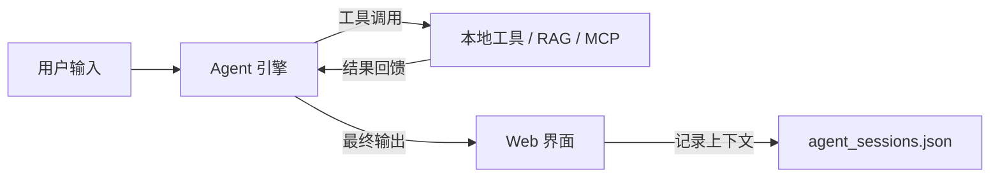

# DeepSeek Agent Project

基于 DeepSeek API（OpenAI 兼容协议）构建的个人 AI 助手。支持工具调用、多轮对话持久化、子代理并行执行、语义缓存、**RAG 知识库（混合检索）**、MCP 服务器集成（38 个社区工具）和 FastAPI + SSE Web 界面。

## 项目结构

```
NN_text1/
├── .env                   # API 密钥（需自行创建）
├── agent.py               # Agent v1（简单agent模式，终端入口）
├── agentv2.py             # Agent v2（流式 + MCP + 记忆系统，终端入口）
├── agent_config.py        # 全局配置中心（9 个子配置，支持环境变量覆盖）
├── agent_sessions.json    # 会话持久化存储
├── chat.py                # 终端聊天工具（纯对话演示demo）
├── docker-compose.yml     # 一键部署
├── Dockerfile             # 容器化镜像
├── feishu_bot.py          # 飞书机器人入口
├── index.html             # Web 聊天页面
├── requirements.txt       # Python 依赖
├── README.md              # 项目必读
├── server.py              # FastAPI 服务（SSE 流式 + 多会话管理）
├── sessions_index.json    # 多会话索引
│
├── core/                  # ⚙️ 核心引擎
│   ├── tools.py           #   ToolRegistry + 工具函数 + SessionStore + SubagentPool + SemanticCache
│   ├── memory.py          #   三级记忆：短期滑动窗口 + 中期摘要 + 长期 ChromaDB
│   └── local_llm.py       #   本地 Qwen2.5-1.5B (4-bit)：任务分类 + 对话摘要
│
├── mcp/                   # 🔌 MCP 协议
│   ├── client.py          #   MCP 客户端：同步 subprocess，JSON-RPC
│   └── manager.py         #   MCP 管理器：多服务器发现、前缀路由
│
├── rag/                   # 📚 RAG 知识库
│   ├── build_knowledge.py #   知识库构建：md 读取 → 切片 → 编码 → 向量库 + BM25
│   ├── rag_tool.py        #   混合检索：语义 + BM25 + RRF 合并 + 重排序
│   ├── eval_rag.py        #   检索评估：向量 vs 混合检索对比
│   └── inspect_kb.py      #   知识库内容查看
│
├── channels/              # 📨 消息通道
│   ├── base_channel.py    #   抽象基类
│   └── feishu_channel.py  #   飞书适配器（WebSocket）
│
└── rag_data/              # 知识库数据（ChromaDB + BM25 索引）
```

### 架构流程



### 核心循环（agentv2.py）

- **ReAct 循环**：模型输出 → 工具调用 → 结果回喂 → 继续推理，最多 20 轮（可以自行限制）
- **流式输出**：`run_stream()` 生成器 + SSE 推送到浏览器（逐字显示）
- **会话持久化**：每轮对话写入 `agent_sessions.json`，跨轮次记忆恢复
- **语义缓存**：命中相似问题（余弦相似度 ≥ 0.85）时直接返回缓存回答
- **MCP 集成**：自动发现并注册社区 MCP 服务器工具，多服务器共存
- **子代理**：通过 `subagent_task` 暴露给模型，支持独立上下文 + 并行执行
- **RAG 混合检索**：向量语义检索 + BM25 关键词检索 + RRF 合并
- **MCP 按需启用**：通过 `/mcp on` / `/mcp off` 命令在对话中控制 MCP 工具开关
- **网络搜索**：`web_fetch` 工具支持获取 URL 内容，内置 trafilatura 正文提取 + 正则去标签双重保障
- **文件写入保护**：`write_file_tool` 改为两步确认，先返回预览，用户同意后调用 `confirm_write` 执行
- **轮次上限强制输出**：最后一轮自动设置 `tool_choice="none"`，确保 LLM 必定输出最终回答
- **本地 LLM 任务分类**：Qwen2.5-1.5B (4-bit) 入口预判是否需要工具，简单问题走简化 prompt，省 Token 省成本
- **三级记忆系统**：短期 8 轮滑动窗口 + 中期摘要(本地模型生成) + 长期 ChromaDB 归档

### 工具系统

#### 本地工具（tools.py）

| 工具名 | 功能 |
|--------|------|
| `calculator` | 安全数学表达式计算 |
| `confirm_write` | 确认并执行待写入操作（配合 write_file_tool 两步确认） |
| `grep_tool` | 在 .py/.ts/.md 中搜索文本 |
| `rag_query` | 混合检索知识库（向量 + BM25 + RRF） |
| `read_file_tool` | 读取文件内容 |
| `search_files_tool` | 按通配符搜索文件名 |
| `shell_tool` | 执行 shell 命令（含危险命令黑名单） |
| `subagent_task` | 启动子代理执行独立任务 |
| `web_fetch` | 获取网页内容并提取正文（trafilatura 清洗 HTML） |
| `write_file_tool` | 写入文件（需用户确认后执行） |

#### MCP 工具（mcp_client.py / mcp_manager.py）

同步 subprocess 实现，自行拼 JSON-RPC 报文，零 async/anyio 依赖。

| 前缀 | 来源 | 注册工具数 |
|------|------|:---------:|
| `filesystem_*` | `@modelcontextprotocol/server-filesystem` | 14 |
| `notion_API-*` | `@notionhq/notion-mcp-server` | 24 |
| **合计** | | **38** |

### RAG 知识库

- **构建与检索分离**：`build_knowledge.py` 独立构建索引，`rag_tool.py` 只做检索
- **递归切片**：按 `##` → `###` → `####` → 段落 层级切割，单块上限 500 字，额外保护文本内公式、代码，避免分散切块
- **混合检索**：bge-small 语义检索 + BM25 关键词检索 + RRF 排名合并
- **阈值筛选**：距离 > 0.7 自动丢弃，节省 Token
- **懒加载**：首次调用 `rag_query` 时加载模型，启动不阻塞
- **来源标记**：metadata 记录文档来源，检索结果附带文件名

### 记忆系统（memory.py）

- **短期记忆**：滑动窗口固定 8 轮完整对话，淘汰时触发归档
- **中期记忆**：淘汰轮由本地 Qwen2.5 生成单句摘要，最多存 9 条；常驻上下文兜底过期历史
- **长期记忆**：淘汰轮全文归档至 ChromaDB 向量库，按需语义召回
- **关键词记忆**：低频增量追加用户偏好/规则/专有名词，持久化到 `keyword_memory.json`
- **摘要生成**：本地已量化 Qwen2.5-1.5B 替代 DeepSeek API，淘汰时异步执行，零 API 费用

### Web 界面（server.py + index.html）

- **FastAPI 服务**：SSE 流式推送，`[tool]`/`[tokens]` 走独立 thinking 事件
- **思考过程折叠**：工具调用信息以浅灰色折叠框展示，回复完成后自动收起，点击展开查看
- **深色主题**：Markdown 渲染、多会话切换、对话历史保留
- 访问 `http://localhost:8000`

## 运行依赖

```bash
pip install openai==2.44.0 python-dotenv==1.2.2 fastapi uvicorn[standard] sse-starlette sentence-transformers chromadb rank-bm25
```

或直接：

```bash
pip install -r requirements.txt
```

## 运行方式

### 0. 安装依赖

```bash
pip install -r requirements.txt
```

### 1. 构建知识库（首次运行前执行）

```bash
# 国内用户需设置镜像
export HF_ENDPOINT=https://hf-mirror.com

# 从 .md 文档构建知识库
python rag/build_knowledge.py RAG_learning/Qwen-Proxy.md
# 或构建整个目录
python rag/build_knowledge.py ./docs/
```

产物存储在 `./rag_data/`（chroma.sqlite3 + bm25_index.pkl）。后续再次启动 agent 时自动加载。

### 2. 终端模式

```bash
python agentv2.py
```

自动连接 MCP 服务器 + 注册本地工具 + 加载知识库。

### 3. Web 界面模式

```bash
python server.py
```

浏览器访问 `http://localhost:8000`。支持多会话切换、流式输出、Markdown 渲染。

### 4. Docker 部署

#### 方式一：从 Docker Hub 拉取（推荐）

```bash
# 拉取镜像
docker pull violet/dev_agent:0.1.2

# 准备数据目录
mkdir -p ./rag_data

# 启动容器
docker compose up -d
```

#### 方式二：本地构建

```bash
docker compose build
docker compose up -d
```

访问 `http://localhost:8000`。

首次启动时需构建知识库：

```bash
# 方法一：宿主机有 Python 环境时直接构建
export HF_ENDPOINT=https://hf-mirror.com
python rag/build_knowledge.py ./docs/

# 方法二：通过容器构建（宿主机无需 Python）
docker compose run --rm \
  -v ./docs:/app/docs \
  -v ./rag_data:/app/rag_data \
  -e HF_ENDPOINT=https://hf-mirror.com \
  agent python rag/build_knowledge.py /app/docs/
```

### 5. 检索效果评估

```bash
python rag/eval_rag.py
```

输出 Recall@K 指标。

### 6. 飞书机器人模式

```bash
python feishu_bot.py
```

需配置飞书应用凭证（`FEISHU_APP_ID` + `FEISHU_APP_SECRET`），通过 WebSocket 长连接接收消息并回复（富文本格式）。

### 7. 对话控制命令

在对话中输入以下命令控制 Agent 行为：

| 命令 | 作用 |
|------|------|
| `/mcp on` | 启用 MCP 工具（filesystem + notion） |
| `/mcp off` | 禁用 MCP 工具，切换为本地工具 |
| `/help` 或 `/h` | 显示可用命令列表 |

### 8. 本地 LLM（可选）

首次运行 agent 时会自动下载 Qwen2.5-1.5B-Instruct 4-bit 量化模型（~750MB）。
也可手动下载：

```bash
export HF_ENDPOINT=https://hf-mirror.com
python -c "from core.local_llm import classify; print(classify('test'))"
```

下载完成后设置离线模式：

```bash
export HF_HUB_OFFLINE=1
python agentv2.py
```

本地模型承担任务分类和淘汰轮次的摘要生成，不参与主 LLM 推理，不影响回答质量。

## 环境变量

创建 `.env` 文件：

```
DEEPSEEK_API_KEY=sk-your-key-here
```

### 配置覆盖（可选）

`agent_config.py` 中的全部配置项可通过 `AGENT__{key}` 环境变量覆盖，无需修改代码：

```bash
# 覆盖 LLM 地址
export AGENT__LLM_BASE_URL=https://custom.endpoint

# 覆盖知识库路径
export AGENT__DB_PATH=./my_rag_data

# 覆盖服务端口
export AGENT__SERVER_PORT=9000

# 覆盖模型名
export AGENT__EMBEDDING_MODEL_NAME=BAAI/bge-large-zh-v1.5

# 覆盖最大对话轮次
export AGENT__MAX_TURNS=30
```

## 已知待改进项

- 语义缓存的 `_embed()` 使用空格分词，对中文效果差
- Rerank 尚未默认启用（需要数据量 > 1000 条或手动开启）
- MCP 的 `readline()` 无超时机制
- BM25 中文分词依赖 jieba 库，需单独安装
- Docker 镜像体积偏大（~2GB），可考虑多阶段构建

---

## 版本记录

### v2.5 — 飞书接入 + 全局配置 + 分文件夹管理（当前版本）

**新增渠道：**
- 飞书机器人正式接入：通过 WebSocket 长连接与飞书通信，支持私聊与群聊
- 飞书消息支持富文本（`post`）格式：代码块分段展示、粗体保留、行内代码反引号标记，告别纯文本扁平显示
- 消息通道抽象：`channels/` 目录下定义 `BaseChannel` 基类 + `FeishuChannel` 适配器，便于后续扩展更多消息渠道

**功能改进：**
- Web 前端思考过程折叠：`[tool]`/`[tokens]` 信息以浅灰色折叠框单独展示，回复完成后自动收起，点击展开查看详细思考过程，正文区域更清爽
- BM25 中文分词升级（空格 split → jieba 分词），中英文混合文档检索准确率显著提升

**架构调整：**
- 代码分文件夹管理：核心引擎移至 `core/`，MCP 协议移至 `mcp/`，RAG 知识库移至 `rag/`，入口文件保留在根目录，结构更清晰
- 新建 `agent_config.py` 全局配置中心，统一管理 LLM、Embedding、Chroma、RAG、Memory、Cache、Tool、Server、Billing 共 9 类配置项，支持 `AGENT__xxx` 环境变量覆盖

**依赖新增：**
- `jieba>=0.42.1` — BM25 中文分词

---

### v2.4 — 本地 LLM + 三级记忆

**新增文件：**
- `local_llm.py` — Qwen2.5-1.5B 4-bit 量化封装（任务分类 + 对话摘要）
- `memory.py` — 三级记忆系统（ShortTermMemory / MidTermMemory / LongTermMemory / KeywordMemory）

**能力提升：**
- 入口预分类：本地 Qwen2.5 判断是否需要工具，简单问题走简化 prompt，省 Token 省成本
- 淘汰式摘要：淘汰轮次由本地模型生成中期摘要，零 API 费用
- 关键词记忆：LLM 发现用户偏好/规则时增量追加，低频更新
- 缓存友好：系统 prompt 先于中期摘要/短期历史拼接，前缀命中率高，减少总 Token 避免窗口容量爆炸
- `_compress_for_storage`：工具返回结果压缩后存入短期记忆，减少上下文膨胀
- `_run_loop` 与 `run_stream` 共享拆分逻辑，消除代码重复

**依赖新增：**
- `transformers` — 加载 Qwen 模型
- `bitsandbytes` — 4-bit 量化支持
- `accelerate` — 模型分发

---

### v2.3 — 网络搜索 + 对话控制 + 写入保护

**新增文件：** `Agent实际问题记录.md`

**能力提升：**
- `web_fetch` 工具：获取 URL 网页内容，内置 trafilatura 正文提取 + 正则去标签双重保障
- MCP 按需启用：通过 `/mcp on`/`/mcp off` 命令在对话中控制工具开关
- 文件写入保护：`write_file_tool` 改为两步确认，先返回预览，用户同意后调用 `confirm_write` 执行
- 内容清洗：`web_fetch` 返回纯正文而非原始 HTML，减少 LLM 噪音
- 轮次上限强制输出：最后一轮自动禁止工具调用，确保 LLM 输出最终回答
- MCP 全局二进制检测：自动判断容器内全局包 / 本地 npx，优化连接速度
- `ToolRegistry` 新增 `remove()` 方法，支持运行时注销工具
- 部署效果优化：优化部署后工具载入、调用流程，并上传仓库方便拉取

**依赖新增：**
- `trafilatura` — 网页正文提取
- `lxml[html-clean]` — trafilatura 依赖


---

### v2.2 — 混合检索 + 部署

**新增文件：**
- `build_knowledge.py` — 独立知识库构建工具（递归切片 + 编码 + 向量库 + BM25 索引）
- `Dockerfile` / `docker-compose.yml` — 容器化部署
- `eval_rag.py` — 检索效果评估脚本

**能力提升：**
- 检索从纯语义升级为混合检索：bge-small 向量 + BM25 关键词 + RRF 合并
- 构建与检索彻底分离，多次构建可增量追加
- Docker 一键部署，不再依赖宿主机 Python 环境
- 评估脚本可量化 Recall@K

**依赖新增：**
- `rank-bm25` — BM25 倒排索引检索

---

### v2.1 — RAG 知识库集成

**新增文件：** `rag_tool.py`

**能力提升：**
- Agent 新增 `rag_query` 工具，支持知识库语义检索
- 模型延迟加载，启动不阻塞
- 距离阈值（≤ 0.7 保留）自动过滤不相关内容

---

### v2.0 — MCP 集成

**能力提升：**
- 工具数从 8 个扩展到 38 个（filesystem + notion）
- 同步 subprocess + 手动 JSON-RPC 实现 MCP 协议，零 async/anyio 依赖
- 多服务器自动发现、工具名前缀路由，防止命名冲突
- 解决 Windows 上 async cancel scope 崩溃问题，最终采用同步方案

---

### v1.3 — Web 界面

**能力提升：**
- 从终端交互升级为 HTTP 服务，浏览器访问 `http://localhost:8000`
- SSE 流式推送 + 缓冲区机制（标点断句 / 50 字兜底）
- 深色主题 Markdown 渲染、多会话切换

---

### v1.2 — 语义缓存 + 子代理

**能力提升：**
- `SemanticCache`：词袋嵌入 + 余弦相似度，命中时跳过 API 调用
- `SubagentPool`：独立上下文子代理 + ThreadPoolExecutor 并行执行
- 修复 assistant(tool_calls) 存入 SessionStore 时的序列化问题

---

### v1.1 — 会话持久化

**能力提升：**
- `SessionStore`：JSON 文件持久化，跨轮次记忆恢复
- `run()` / `run_stream()` 接收 `session_id` 参数，支持多会话隔离

---

### v1.0 — 初版

**能力提升：**
- 基础 ReAct 循环，支持 8 个手写工具
- `ToolRegistry`：工具注册、dispatch、JSON Schema 自动生成
- 终端交互模式，支持多轮对话
